# **1. Tên dự án:**
Website bán vé xem phim sử dụng Java Sping Boot.
<br/>

# **2. Giới thiệu:**
Xây dựng website quản lý bán vé xem phim với các tính năng chính: tìm kiếm phim, đặt vé, chọn suất chiếu và thanh toán.
Đây là repo tổng hợp lại từ 2 repo khác do chính nhóm em phát triển:
- Back-end: https://github.com/FloRRenn/Java-Web/tree/backend
- Front end: https://github.com/FloRRenn/Fe-java/
<br/>

# **3. Thành viên nhóm:**
| Sinh Viên                | MSSV         | Github Username   |
| :----------------------- |:-----------: | -----------------:|
| Phạm Phúc Đức            | 20520162     | [ducdottoan2002](https://github.com/ducdottoan2002)|
| Nguyễn Hoàng Phúc        | 20520277     | [hoangfphucs](https://github.com/hoangfphucs)|
| Nguyễn Đức Tấn           | 20520751     | [FloRRenn](https://github.com/FloRRenn)|
| Nguyễn Nhật Hiếu Trung   | 20520830     | [nnhieutrung](https://github.com/nnhieutrung)|
<br/>

# **4. Công nghệ:**
- **Database: MySQL 8.0.32**

- **Backend: Restful API**
  - Java 17
  - Spring Boot 3.0.6
  - Maven 3.9.1
  - JWT (io.jsonwebtoken) 0.11.5

- **Frontend:**
	- HTML
	- CSS
	- JS

- **Khác:**
	- Docker: Cho phép triển khai project nhanh chóng trên các máy tính khác nhau.
	- Nginx: Dựng server cho các web service trong docker.
	- Sandbox của VNPay: Tích hợp ứng dụng thanh toán của VNPAY trong việc đặt vé.
<br/><br/>

# **5. Cài đặt:**
#### Yêu cầu phải máy tính phải cài đặt sẵn `docker` và `docker-compose`
#### Tại thư mục mẹ, gõ lệnh dưới để chạy project:
```shell
docker-compose up --build --no-deps
```
#### Dừng project bằng `Ctrl + C` và gõ lệnh:
```shell
docker-compose down
```
<br/>

# **6. Thông tin:**
### **A. Các Website:**
- Website chính (Front-end): http://localhost:80
	- Hiển thị nội dung liên quan đến phim và cho phép đặt/thanh toán vé.
<br/><br/>
- Website Admin (Front-end): http://localhost:81
	- Trang admin cho phép quản lý các nội dung trên website chính và các user. Yêu cầu tài khoản có quyền `admin` để đăng nhập. 
<br/><br/>
- Website cho API (Back-end): http://localhost:9595
	- Xử lý các request được gửi từ front-end.
    - Xem chi tiết tại http://localhost:9595/swagger-ui/index.html
<br/><br/>
- Website cho Database (Back-end): http://localhost:32346
	- Hiển thị trực quan database của web (dùng [PHPMyAdmin](https://www.phpmyadmin.net/)).
<br/>

### **B. Thông tin đăng nhập:**
| Username         | Password      | Role        |
|:-----------------|:-------------:|:-----------:|
| super_admin.1234 | 3Mt^tmM85YUL  | Super Admin |
| admin.1234       | TiNkErBeLl    | Admin       |
| user_1	       | k9G*Ni91r!    | User        |
| user_2	       | hS5f%1*8V1    | User        |

### **C. Thông tin thanh toán VNPAY:**
- Ngân hàng:&nbsp;&nbsp;&nbsp;&nbsp;&nbsp;&nbsp;&nbsp;&nbsp;&nbsp;&nbsp;&nbsp;`NCB`
- Số thẻ:&nbsp;&nbsp;&nbsp;&nbsp;&nbsp;&nbsp;&nbsp;&nbsp;&nbsp;&nbsp;&nbsp;&nbsp;&nbsp;&nbsp;&nbsp;&nbsp;&nbsp;&nbsp;&nbsp;`9704198526191432198`
- Tên chủ thẻ:&nbsp;&nbsp;&nbsp;&nbsp;&nbsp;&nbsp;&nbsp;&nbsp;&nbsp;&nbsp;&nbsp;`NGUYEN VAN A`
- Ngày phát hành:&nbsp;&nbsp;&nbsp;&nbsp;`07/15`
- Mật khẩu OTP:&nbsp;&nbsp;&nbsp;&nbsp;&nbsp;&nbsp;&nbsp;`123456`
<br/><br/>

# **7. Mô hình hoạt động:**
### &nbsp;&nbsp;&nbsp;&nbsp;&nbsp;**A. Mô hình Database:**
<div align='center'>
	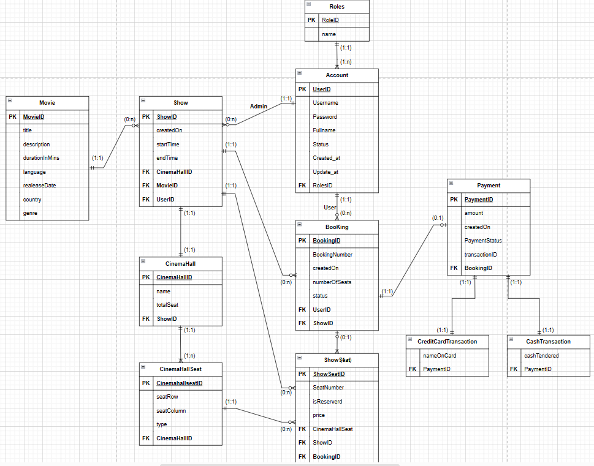
</div>
<br/>

### &nbsp;&nbsp;&nbsp;&nbsp;&nbsp;**B. Mô hình hoạt động cơ bản:**
<div align='center'>
	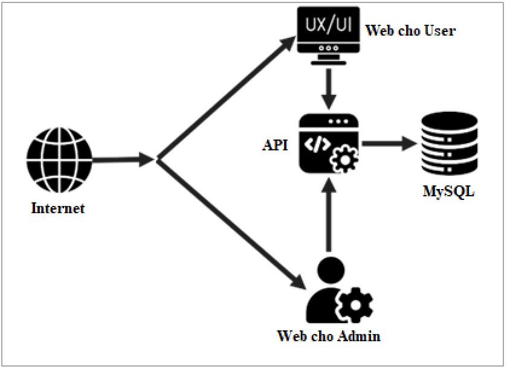
</div>
<br/>

### &nbsp;&nbsp;&nbsp;&nbsp;&nbsp;**C. Mô hình hoạt động của website dành cho User:**
<div align='center'>
	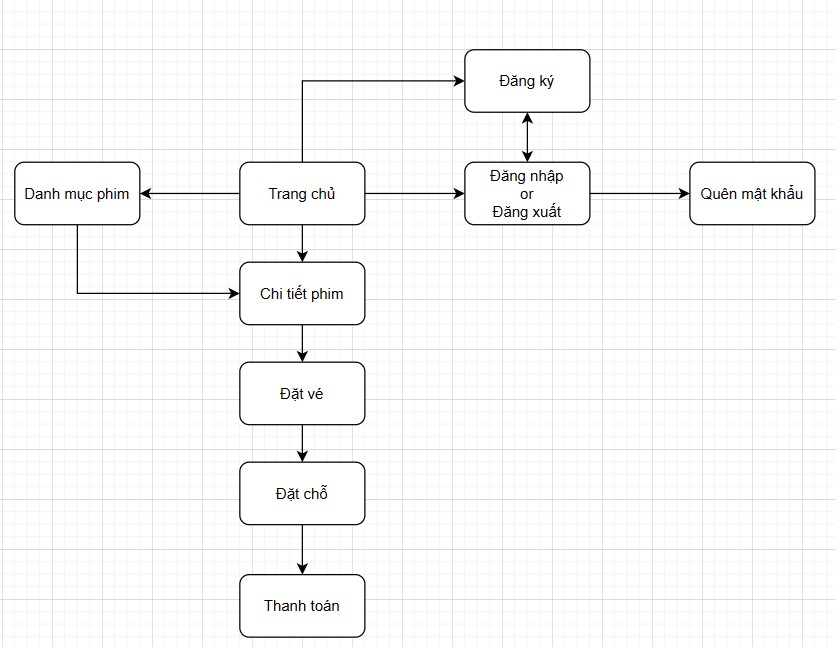
</div>
<br/>

### &nbsp;&nbsp;&nbsp;&nbsp;&nbsp;**D. Mô hình hoạt động của website dành cho Admin:**
<div align='center'>
	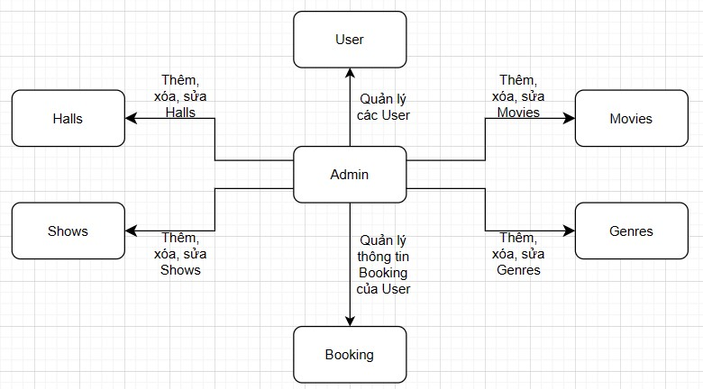
</div>
<br/><br/>

# **8. Chức năng của trang web:**
### **A. Chức năng của User:**
- Đăng ký
	+ Xác thực tài khoản qua email
- Đăng nhập
- Đăng xuất
- Quên mật khẩu
	+ Xác nhận mật khẩu mới qua email
- Tìm kiếm phim theo từ khóa, thể loại
- Đặ̣t vé:
	+ Lựa chọn suất chiếu(ngày, giờ, phòng chiếu)
	+ Chọn chỗ ngồi
	+ Thanh toán (VNPAY, QR Code, Thẻ Nội Địa, Thể Quốc Tế) i
    	* Gửi vé điện tử và chi tiết thanh toán qua email khi thanh toán thành công.

### **B. Chức năng của Admin:**
- Quản lý user.
- Thêm, xóa, sữa dữ liệu liên quan đến các suất chiếu phim như: phim chiếu, lịch chiếu, phòng chiếu, số lượng ghế và lưu lại thông tin thanh toán.
<br/><br/>

# **9. Bảo mật:**
### Sử dụng JWT (JSON Web Token) để phân quyền truy cập và xác thực user.
### Cấu trúc của token:
#### &nbsp;&nbsp;1. Thuật toán sử dụng: `RS256` với key có kích thước `2048 bit`
#### &nbsp;&nbsp;2. Loại data có trong token bao gồm:
- `roles` : Dùng để phân quyền người dùng, bao gồm `SUPER_ADMIN`, `ADMIN`, `USER` 
- `sub` : Chứa username của người dùng.
- `iat` : Lưu thời điểm tạo token.
- `exp` : Lưu thời điểm hết hạn của token (sau 1 giờ kể từ lúc tạo)

<br/>

# **10. Demo:**
## **10.1. Website cho User:**

### &nbsp;&nbsp;&nbsp;&nbsp;&nbsp;**A. Trang Chủ**
<div align='center'>
	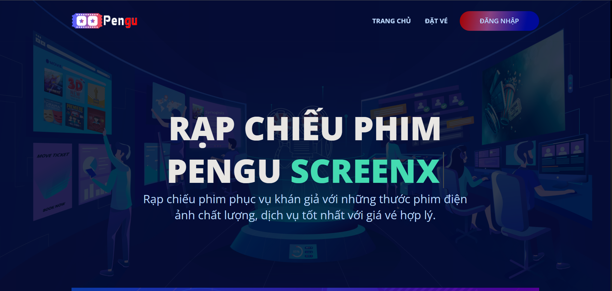
</div>
</br>

### &nbsp;&nbsp;&nbsp;&nbsp;&nbsp;**B. Đăng nhập/đăng ký User:**
<div align='center'>
	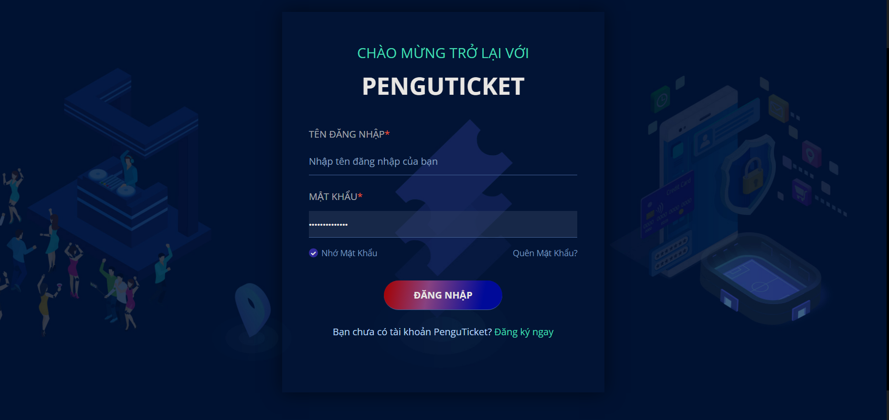
	<br>
	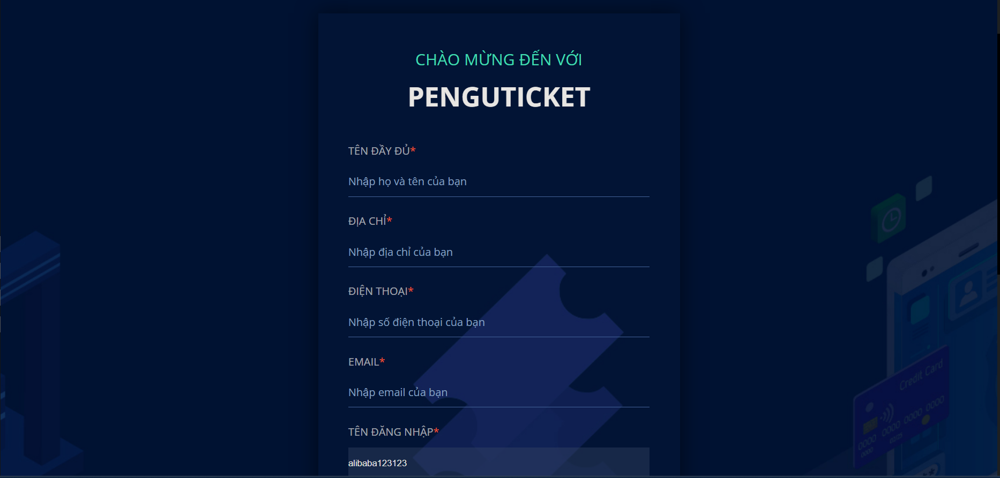
</div>
</br>

### &nbsp;&nbsp;&nbsp;&nbsp;&nbsp;**C. Trang chọn phim**
<div align='center'>
	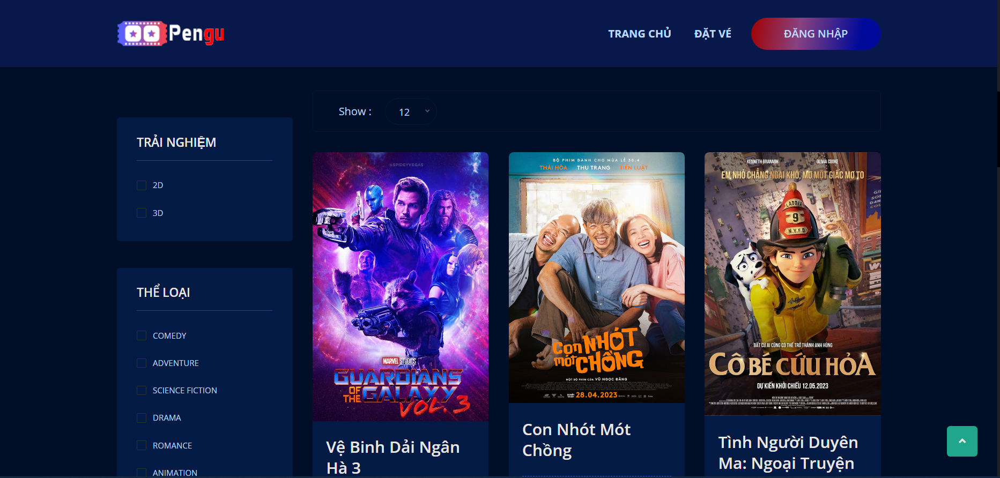
</div>
</br>

### &nbsp;&nbsp;&nbsp;&nbsp;&nbsp;**D. Trang chi tiết phim:**
<div align='center'>
	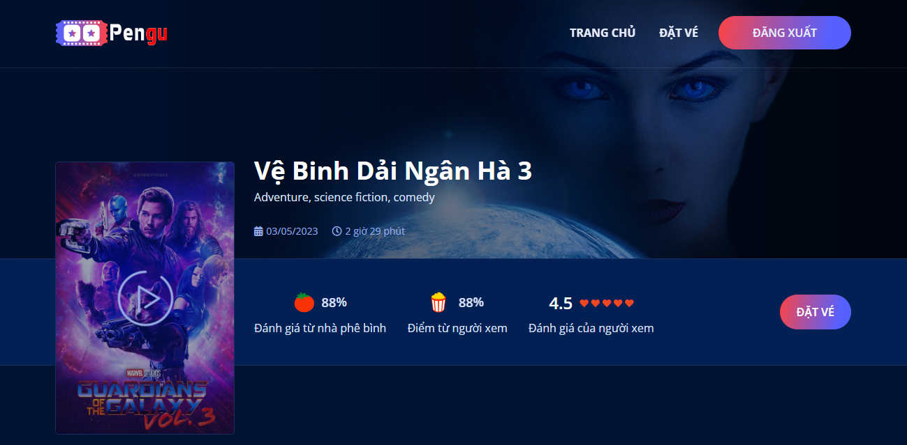
</div>
</br>

### &nbsp;&nbsp;&nbsp;&nbsp;&nbsp;**E. Trang chọn giờ xem:**
<div align='center'>
	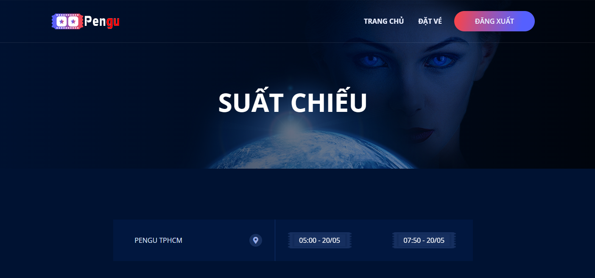
</div>
</br>

### &nbsp;&nbsp;&nbsp;&nbsp;&nbsp;**F. Trang Chọn ghế:**
<div align='center'>
	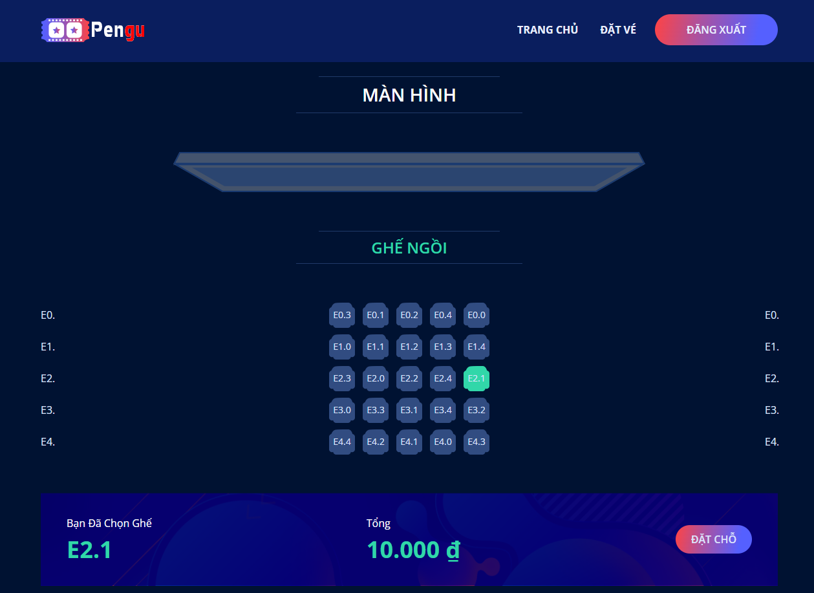
</div>
</br>

### &nbsp;&nbsp;&nbsp;&nbsp;&nbsp;**G. Trang thanh toán:**
<div align='center'>
	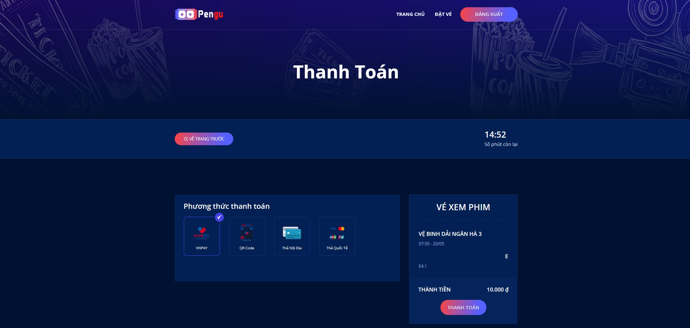
</div>
</br></br>

## **10.2. Website cho Admin:**
### &nbsp;&nbsp;&nbsp;&nbsp;&nbsp;**A. Đăng nhập Admin:**
<div align='center'>
	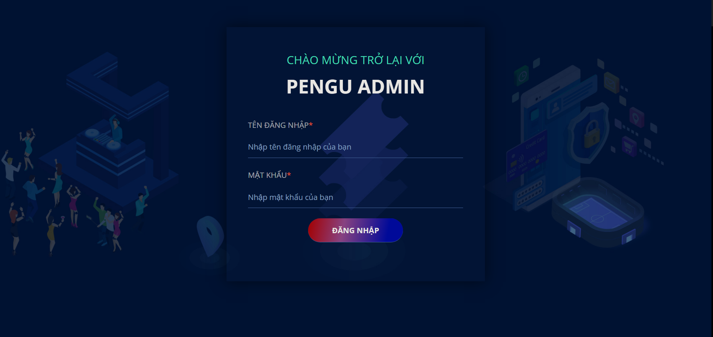
</div>
</br>

### &nbsp;&nbsp;&nbsp;&nbsp;&nbsp;**B. Admin quản lý tài khoản:**
<div align='center'>
	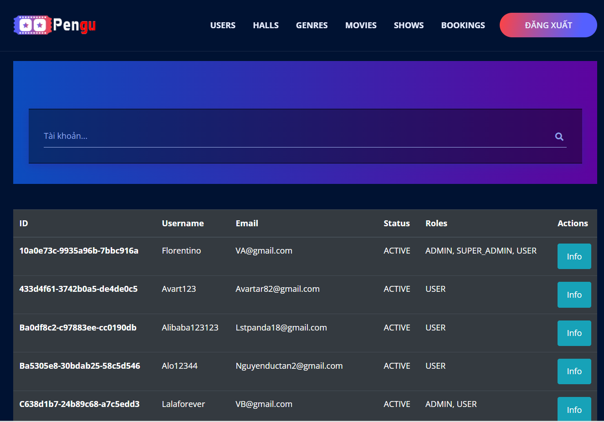
</div>
</br>

### &nbsp;&nbsp;&nbsp;&nbsp;&nbsp;**C. Admin thêm suất chiếu:**
<div align='center'>
	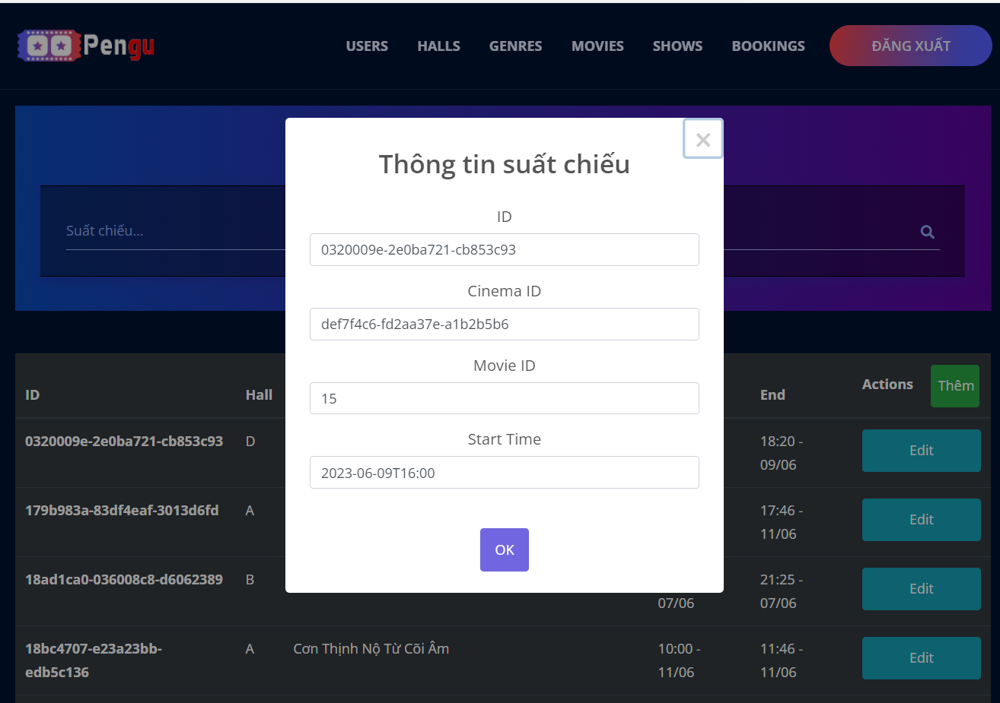
</div>
</br></br>

## **10.3. Website cho API:**
### &nbsp;&nbsp;&nbsp;&nbsp;&nbsp;**Trang API document:**
<div align='center'>
	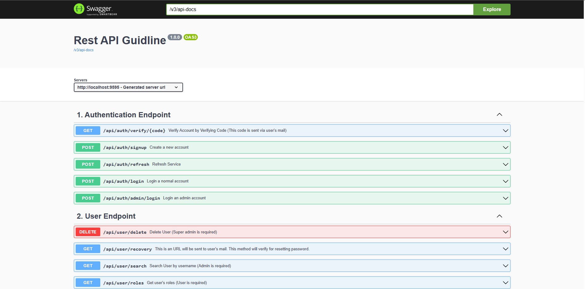
</div>
</br></br>

# **11. Các Lỗ hổng được thiết kế trong website:**
### **A. Bypass xác thực của JWT Token:**
&nbsp;&nbsp;&nbsp;&nbsp;&nbsp;&nbsp;Web API sử dụng JWT token để xác thực và phân quyền người dùng, thuật toán được sử dụng cho việc cấp và xác thực là RS256. Lỗ hổng này được mô phỏng dựa trên CVE-2015-9235, xảy ra là trang web sẽ dựa vào thuật toán trên phần header của token để thực hiện quy trình xác thực sẽ thuật toán đó. Khi trang web sử dụng thuật toán RS/ES để ký (dùng private key) và xác thực (dùng public key) cho token, nhưng khi kẻ tấn công có được public key, chúng sẽ sử dụng thuật toán HS (dùng public key cho cả việc ký và xác thực) để tạo token, khi đưa cho web kiểm tra, nó sẽ dựa vào thuật toán trong phần header của token để lựa chọn thuật toán xác thực, và vì cả thuật toán RS/ES và HS đều dùng public key để xác thực nên việc bypass sẽ thành công. 
#### &nbsp;&nbsp;&nbsp;&nbsp;&nbsp;&nbsp;**Mức độ ảnh hưởng:** Cao.
#### &nbsp;&nbsp;&nbsp;&nbsp;&nbsp;&nbsp;**Phạm vi ảnh hưởng:** Toàn bộ các trang web.
#### &nbsp;&nbsp;&nbsp;&nbsp;&nbsp;&nbsp;**Hậu quả:** Leo thang đặc quyền, có khả năng lấy và chỉnh sửa toàn bộ data có trong database thông qua các API.
</br>

### **B. Broken Access Control:**
&nbsp;&nbsp;&nbsp;&nbsp;&nbsp;&nbsp;Uri GET /api/auth/login không có cơ chế giới hạn lượt truy cập sau nhiều lần đăng nhập không thành công dẫn đến kẻ tấn công có thể thực hiện tấn công brute-force để dò mật khẩu của nạn nhân.
#### &nbsp;&nbsp;&nbsp;&nbsp;&nbsp;&nbsp;**Mức độ ảnh hưởng:** Trung bình.
#### &nbsp;&nbsp;&nbsp;&nbsp;&nbsp;&nbsp;**Phạm vi ảnh hưởng:** Chỉ ảnh hường đến user để mật khẩu yếu và dễ đoán.
#### &nbsp;&nbsp;&nbsp;&nbsp;&nbsp;&nbsp;**Hậu quả:** Đánh cắp thông tin và kiểm soát tài khoản của nạn nhân.
</br>

### **C. Insecure Authentication:**
&nbsp;&nbsp;&nbsp;&nbsp;&nbsp;&nbsp;Trang web có chức năng thay đổi mật khẩu mới khi người dùng quên mật khẩu, khi đó một mã xác thực sẽ được gửi đến mail của người dùng, cho phép họ thay đổi mật khẩu cho mình. Trong mã xác thực này chứ tên của người dùng và thời hạn sử dụng, trang web sẽ dựa trên các thông tin này để cho phép đổi mật khẩu mới hay không, tuy nhiên mã xác thực này rất yếu, kẻ tấn công có khả năng tạo một mã xác thực khác tương tự và có thể thay đổi mật khẩu của bất kỳ user nào trong hệ thống.
#### &nbsp;&nbsp;&nbsp;&nbsp;&nbsp;&nbsp;**Mức độ ảnh hưởng:** Cao.
#### &nbsp;&nbsp;&nbsp;&nbsp;&nbsp;&nbsp;**Phạm vi ảnh hưởng:** Tất cả user tồn tại trong hệ thống.
#### &nbsp;&nbsp;&nbsp;&nbsp;&nbsp;&nbsp;**Hậu quả:** Đánh cắp thông tin và kiểm soát tài khoản của nạn nhân. Leo thang đặc quyền đối các tài khoản admin.
</br>

### **D. Lỗ hổng**
&nbsp;&nbsp;&nbsp;&nbsp;&nbsp;&nbsp;Lỗ hổng
#### &nbsp;&nbsp;&nbsp;&nbsp;&nbsp;&nbsp;**Mức độ ảnh hưởng:**
#### &nbsp;&nbsp;&nbsp;&nbsp;&nbsp;&nbsp;**Phạm vi ảnh hưởng:**
#### &nbsp;&nbsp;&nbsp;&nbsp;&nbsp;&nbsp;**Hậu quả:**
</br>

### **E. Lỗ hổng**
&nbsp;&nbsp;&nbsp;&nbsp;&nbsp;&nbsp;Lỗ hổng
#### &nbsp;&nbsp;&nbsp;&nbsp;&nbsp;&nbsp;**Mức độ ảnh hưởng:**
#### &nbsp;&nbsp;&nbsp;&nbsp;&nbsp;&nbsp;**Phạm vi ảnh hưởng:**
#### &nbsp;&nbsp;&nbsp;&nbsp;&nbsp;&nbsp;**Hậu quả:**
</br>

### **F. Lỗ hổng**
&nbsp;&nbsp;&nbsp;&nbsp;&nbsp;&nbsp;Lỗ hổng
#### &nbsp;&nbsp;&nbsp;&nbsp;&nbsp;&nbsp;**Mức độ ảnh hưởng:**
#### &nbsp;&nbsp;&nbsp;&nbsp;&nbsp;&nbsp;**Phạm vi ảnh hưởng:**
#### &nbsp;&nbsp;&nbsp;&nbsp;&nbsp;&nbsp;**Hậu quả:**
</br>

---
© Group **Pengu** - University of Information Technology